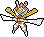

# kartana 

Kartana is a tool for making pages of RPG content (or any content really).

It turns a directory of Markdown files (`./pages/*.md`) into: a PDF or HTML file.

## Usage

### PDF

To generate a PDF run`make pdf`. You can also simply run `make`, since `pdf` is the default target.

### HTML

To generate an HTML file, run `make html`.

### Help

Running `make help` will show a list of all the included make commands and summaries of each:

```
pdf:                           Generates output.pdf
html:                          Generates output.html
all: pdf html                  Generates both HTML and PDF
clean:                         Deletes generated HTML and PDF files
open:                          opens the PDF with your default viewer using the `open` command
help:                          Shows this help.
```

## Design

* author content in individual Markdown files
* separate presentation and content.
* standard tooling and assets likely to be on a dev system
* build to different page sizes
* build to static HTML

### TODO

* CSS
* citations; links to other CC-BY-SA sources
* letter size
* epub
* link color
* make "install" (print a message about dependencies)

### Stretch

* Github Actions for publishing to Netlify and/or itch.io
* automatically import content from CC licensed sources

## Credits

### Pandoc

* https://jdhao.github.io/2019/05/30/markdown2pdf_pandoc/
* https://www.soimort.org/notes/161117/
* https://en.wikibooks.org/wiki/LaTeX/Page_Layout
* https://www.overleaf.com/learn/latex/Headers_and_footers
* https://texdoc.org/serve/geometry.pdf/0
* https://pandoc.org/MANUAL.html

### CC licensed sources

* https://itch.io/jam/forever-open-source-jam
* https://github.com/yochaigal/cairn
* https://github.com/oznogon/cc-srd5

### Fonts

* Alegreya - https://fontlibrary.org/en/font/alegreya [OFL (SIL Open Font License)](http://scripts.sil.org/OFL)

## License

[]((http://creativecommons.org/licenses/by-sa/4.0/)) This work is licensed under a Creative Commons Attribution-ShareAlike 4.0 International License.
